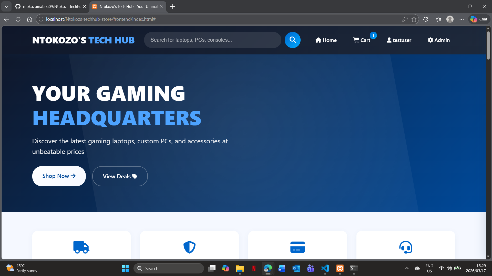
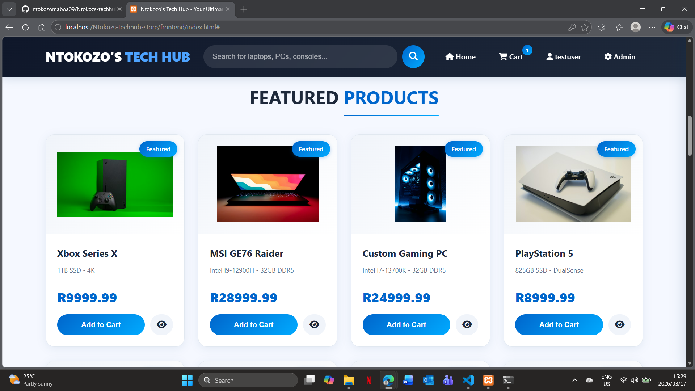
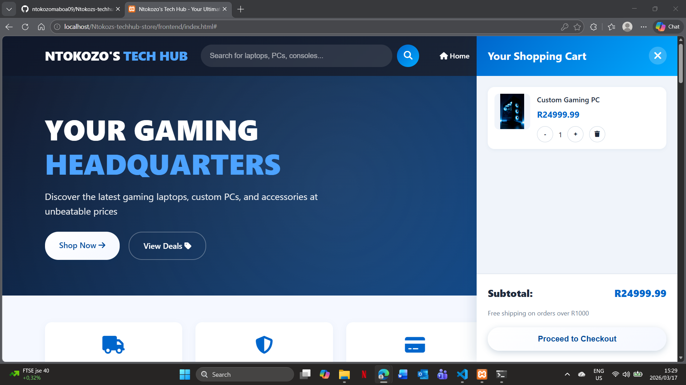
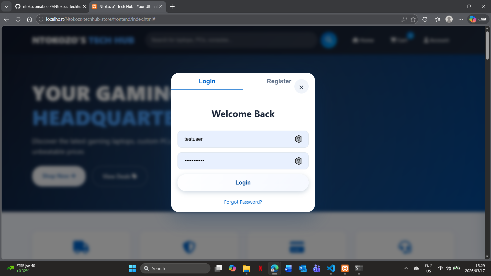
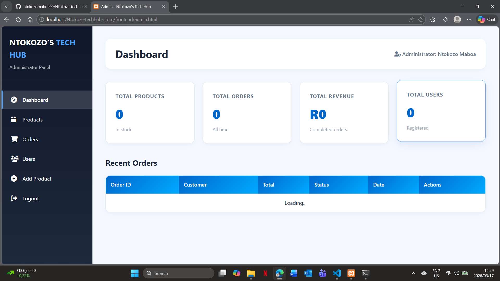

# 🎮 Ntokozs Techhub Store

A complete, full-stack e-commerce website for gaming electronics, featuring a clean blue and white theme inspired by Incredible Connection. Built with Node.js, Express, MySQL, and vanilla JavaScript.

## 📸 Screenshots

### Homepage


### Products Page


### Product Details


### Shopping Cart


### Login & Register


### Admin Dashboard


## ✨ Features

### 🛍️ Customer Features
- **Product Catalog** - Browse gaming laptops, PCs, consoles, and accessories
- **Product Search** - Search for products by name or description
- **Category Filtering** - Filter products by category (Gaming Laptops, PCs, Consoles, etc.)
- **Brand Filtering** - Filter products by brand (ASUS, MSI, Razer, Microsoft, etc.)
- **Product Details** - Click the eye button to view detailed specifications
- **Shopping Cart** - Add/remove products, update quantities
- **User Authentication** - Register and login securely
- **Checkout System** - Place orders with shipping information
- **Order History** - View past orders

### 👑 Admin Features
- **Admin Dashboard** - View store statistics
- **Product Management** - Add, edit, and delete products
- **Order Management** - View and update order status
- **User Management** - View registered users

### 🎨 Design
- **Blue & White Theme** - Clean, professional design inspired by Incredible Connection
- **Fully Responsive** - Works on desktop, tablet, and mobile
- **Interactive Elements** - Hover effects, animations, and modals
- **Shopping Cart Sidebar** - Sliding cart for easy access

## 🛠️ Technologies Used

### Backend
- **Node.js** - JavaScript runtime
- **Express.js** - Web framework
- **MySQL** - Database
- **JWT** - Authentication tokens

### Frontend
- **HTML5** - Structure
- **CSS3** - Styling with custom properties
- **JavaScript** - Client-side functionality
- **Font Awesome** - Icons

### Development Tools
- **XAMPP** - Local development environment
- **Git** - Version control
- **GitHub** - Code repository

## 📋 Prerequisites

Before running this project, make sure you have installed:

- [Node.js](https://nodejs.org/) (v14 or higher)
- [XAMPP](https://www.apachefriends.org/) (for MySQL and Apache)
- [Git](https://git-scm.com/) (optional, for cloning)

## 🚀 Installation & Setup

### 1. Clone the Repository
```bash
git clone https://github.com/ntokozomaboa09/Ntokozs-techhub-store.git
cd Ntokozs-techhub-store